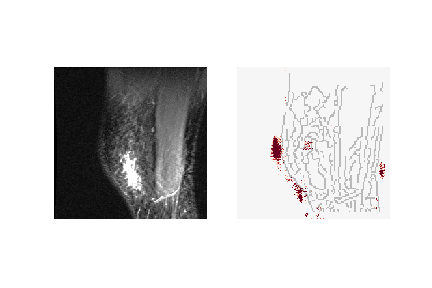

for the code feel free to contact me via andre.antunovic300@gmail.com

# MRNet Challenge - Friedrich Alexander University

A. Antunovic, V. Morgenshtern are participating in the MRNet Challenge by Stanford University.
New approaches, improving on the existing colour activation heatmap provided by the competitors for visualization 
of the images, will be considered. Especially the application of the approach developed
by Brendel and Bethge in 'Approximating CNNs with Bag-of-local-Features models works surprisingly well on ImageNet'
results in much better results regarding the interpreteability of the MRIs.
Furthermore the classification results could be improved by using the pretrained ZFNet as baseline for the designed neural network.


## Setup

`bash download.sh` (caution: downloads ~6.68 GB of data)

`conda env create -f environment.yml`

`mkdir experiment`

## Train

### Usage

```bash
usage: train.py [-h] --rundir RUNDIR --task TASK [--seed SEED] [--gpu]
                   [--learning_rate LEARNING_RATE]
                   [--weight_decay WEIGHT_DECAY] [--epochs EPOCHS]
                   
optional arguments:
  -h, --help            show this help message and exit
  --rundir RUNDIR       With dafult value
  --task TASK           Choose between abnormal/acl/meniscus
  --seed SEED           Selected random seed
  --gpu                 Flag to use GPU
  --learning_rate LEARNING_RATE
  --weight_decay WEIGHT_DECAY
  --epochs EPOCHS

```

### Example

`python train.py --rundir [experiment name] --task [abnormal/acl/meniscus] --gpu`

- Choose the desired task [abnormal/acl/meniscus] and train the network on it
- arguments saved at `experiment/{experiment-name}/args.json`
- prints training & validation metrics (loss & AUC) after each epoch
- models saved at `[experiment-name]/[val_loss]_[train_loss]_epoch[epoch_num]`


## Heatmap

Since the task of diagnosing knee injuries in the near future will rely on human evaluation a big
effort was paid on getting good visualization results.

One can run the Jupiter Notebook HeatmapVisualization.iypnb, choose
the desired knee MRI from: '/data/MRNet-v1.0/[train/valid]/[axial/coronal/sagittal]/{Number}.npy' which should be evaluated 
and load the state dictionary of the chosen neural network from: `experiment/{experiment-name}/args.json`.
In this notebook one can either check how good visualization works for the chosen network or one can create GIFs as the one shown below. This is the sagittal view of a knee MRI, with an 
acl tear. The network successfully identified that the knee has an acl tear with the correct label. The heatmap next to the MRI which is generated by the network shows that it finds the
area where the acl is located really well and identifies it as crucial for the decision about the disease.




Another Jupyiter notebook was created in order to visualize and evaluate the process of the network understanding 
the structure of the knee during the training process.
In order to get a feeling on how the network improves in recognizing the shape and the injured spots of the knee
consider the HeatmapOverEpochs.iypnb notebook. It can be notized easily that after the first epoch the network barely
understands the shape of the knee, but during the learning process the area which leads to the decision that the knee
has an acl tear gets more and more distinct and sharp. 


## Model architecture

- In order to get an understanding for the problem at hand one can follow best by understanding
 the architecture of the baseline Stanford model first [1]. This will be supported in the following by illustrations
 and explainations.


- The network shown above contains a big part of the famous AlexNet, which won the 
ImageNet competition in 2012. This model was used as a starting point 
and basically kept until the last convolutional layer while cutting off the two fully connected layers of AlexNet and  replacing 
them by a linear classifier. 

- When dealing with knee MRIs we always get provided a coronal, an axial and a sagittal view of the knee. The network shown above is in use when we decide to train with only one of these three views. This was mainly done, since it was a good starting point to push further regarding the generation
of heatmaps. Moreover it turned out that we could improve on the classification results of the competitors on the internal validation set by changing to pretrained ZFNet features as a baseline for the task of diagnosing abnormalities and acl tears, while the performance for meniscus tears got only slightly worse.

- The input which is fed into the network is structured as follows. Every single knee MRI contains three views
axial, coronal and sagittal. All of them contain a variable number of pictures which are capturing the knee from left
to right, top down, front to back. Some preprocessing leads to an input to the network for the chosen view: [batchsize, variable_number_of_images, RGB=3, height=224, width=224].
- From the picture of the architecture one has to notice that, by using this baseline for training only batchsize = 1 makes sense, since in the final step before the classifier we maximize accross all pictures of the same MRI to get the most relevant information of the whole sequence.

- Using all three views of the MRI, the following was done. Every single knee MRI contains three views
axial, coronal and sagittal. All of them contain a variable number of pictures which are capturing the knee from left
to right, top down, front to back. So we train all of these views completly independent and in the very end all three decisions get merged together by a linear classifier. This is the network which was used by the competitors.


## Approaching the task of visualization by understanding BoF models

- In order to get a better understanding of what we did to improve on the heatmaps one needs to get a better understanding
of the very impressive work of Wieland Brendel [2], which tackles the interpretability of the output of neural networks.
Since we are still puzzeled by many things regarding neural networks this paper gives a very insightful look on how neural networks might come to their decisions.
- The clue is basically that the input of the network is restricted to small patches of the image and it is still possible to obtain results that can compete to the performance of commonly used state of the art neural networks.
- Working with small patches of the image one can conclude that neural networks seem to make their decisions not by understanding big spatial contexts but by counting lots of small local image features.


## Application and addaption of the heatmap creation technique

- So we pushed in this direction, but had to cope with some issues. 
First of all one has to recognize that the results of the paper are 
completely independent from the neural network architecture. Therefore we sticked
to the promising baseline by the competitors using a pretrained AlexNet.
By some small calculations one finds that the 
patchsize that can be used for the AlexNet architecture without any modifications of 
the network is 47.
- Regarding the visualization of the network resulting in the heatmaps 
we needed to do some adjustments. For every task [abnormal/acl/meniscus] we only had 
one label [0/1] leading to [no injury/injury]. Since a reasonable heatmap should only visualize
the parts of the knee which the network identifies as injured, we clipped all patches that led to logits smaller than
zero exactly to zero, to have best possible visualizations.
- In the picture below one can see how the heatmaps get generated. First of all the image gets preprocessed, in the wake of that, the size changes from 224x224 to 270x270. This is done by zeropadding. Now we slide with our patch of size 47x47 through the whole picture with stride=1. In order to get exactly 222x224=50716 patches, we needed the zeropadding. Each of these patches then get fed independently into the network. Every patch leads to one logit, which is constrained to its own small field of view. Finally, reshaping these 50716 logits creates a 224x224 heatmap.
- Furthermore we had to do minor adjustments in the architecture of the network 
when generating the heatmaps. As discussed above, the network executes a maximization operation over all pictures of the same knee  before the linear classification. This is done in order to get the most relevant information accross all pictures of one view of the knee. When generating heatmaps this operation has to be excluded, since we want to generate a logit for every single patch of every picture of the knee MRI. From
the visualization of the heatmap generation, it can be seen, that through unfolding a single picture we create 224x224 patches
with 47x47 pixels. This leads to an input of [50716, 3, 47, 47]. One should process as many of these 50716 pictures as feasible on the GPU simultaneously. Excluding the torch.max operation while generating the heatmap leads to the exact same results as feeding in all 50716 patches individually to the model, that is why this action is completly
justified.


## ZFNet is boosting auccarcy 


- Many different pretrained neural networks were tested in order to improve on the results of the competitors.
- State of the art networks like ResNet were not trainable on this data. They seemed to be to well fitted to the ImageNet 
 competition to perform good transfer learning. Another issue was, that in contrast to the AlexNet the last feature vector previous to the cutoff and adapting to our classification task was too big. As can be seen from our architecture picture we cut off AlexNet at a spot where the feature vectors are of size 6x6x256, the equal cutoff in ResNet50 would lead to a feature size of 24x24x2048. This would lead to a linear classifier that has to learn 2048 weights from scratch, considering that we only have about 1100 training examples this will not be feasible.
- So we mostly sticked to the AlexNet architecture, but could also successfully apply another network, namely the ZFNet. This is basically the evolution of the AlexNet, which leads to a totally similar architecture. The AlexNet feature part gets replaced by the equivalent ZFNet feature part, which leads only to some small changes regarding the kernel size.
- For all three tasks our accuracy rates could be improved by using this network, in comparison to using AlexNet as a baseline to our model.
- The accuracy rates for the networks, that use a single view and ZFNet archtictrue as baseline are: 

- | Disease        | Valid AUC:    | 
  | -------------  |:-------------:|
  | Abnormal       | 94,5%         |
  | ACL            | 97.2%         | 
  | Meniscus       | 83,7%         | 


- As seen above the networks that were using a single view performed really well and were able to outperform the Stanford Network on the internal evaluation set for the acl and the abnormal task, without using any data augmentation. In order to get best possible classification results using a single view, all possible combinations of the views [axial/sagittal/coronal] and the diseases [abnormal/acl/meniscus] got trained. It turned out that abnormalities can be best classified from the axial view, acl tears can be obtained best by using the sagittal view and for meniscal tears coronal view is the most beneficial one.
- When it comes to the creation of heatmaps the same steps as for AlexNet architecture are executed. Because of small adjustments regarding kernel sizes in ZFNet compared to AlexNet it is even possible to reduce the size of the patches to 39x39. However it turned out that these patches seem to be to small for the task at hand to generate equall good heatmaps, so we sticked to the same patchsize as for AlexNet. A explaination could be that tears and abnormalities of knees are just a too complex task for such a narrow field of view. 


## Scattering Transform
- From a theoretical point of view this classification task seems to be one where Scattering Transform could compete with deep neural networks very well, or even outperform them. However only applying Scattering Transform followed by a linear classifier was not successful at all. But we definetly want to push further in this direction by applying a network architecture similar to the ones discussed in the paper [4]. In a nutshell they combine Scattering Transform and neural networks in an ingenious way. The first part of a neural network is replaced by the Scattering Transform follwed by the rest of the neural network. Benefits are that the first part of the network now is a fully understood mathematical framework which does not have to be trained. The training of these networks is not only faster, it also helps to further reduce the obstacle part of neural networks.

## Data Augmentation 

- Several data augmentation techniques were tested. Especially coarse dropouts in the input image leading to black boxes in the input image and dropout before the linear classifier seemed to be beneficial. But since the overall valid AUC could not be improved, they were excluded for now in order to keep the current in-use networks as plain as possible and to provide a suitable status quo of the network to work further on. 


## References

[1] https://journals.plos.org/plosmedicine/article?id=10.1371/journal.pmed.1002699

[2] https://openreview.net/pdf?id=SkfMWhAqYQ

[3] https://github.com/wielandbrendel/bag-of-local-features-models

[4] https://hal.inria.fr/hal-01837587/document

[5] https://papers.nips.cc/paper/4824-imagenet-classification-with-deep-convolutional-neural-networks.pdf

[6] https://arxiv.org/pdf/1311.2901v3.pdf

 
